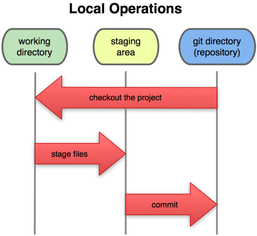
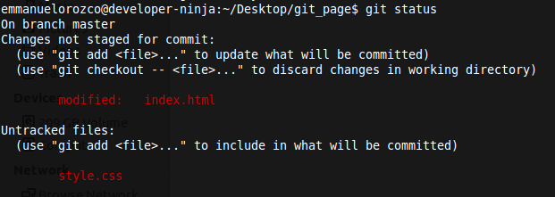
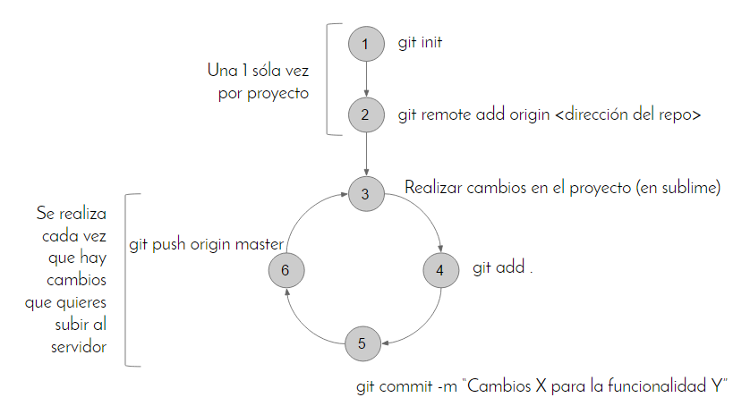

### Pasos de un flujo completo de GIT

| Flujo completo GIT |
| -|

#### Fase 1: "Working directory"

Se realizan cambios en el directorio de trabajo sin afectar el repositorio, en cuanto se hacen cambios en el código se tendrá el status de modificados (creados).

Despues de hacer los cambios se pasan los archivos hacia "staging area" con el comando:

git add nombreArchivoModificado.md

Si se quieren agregar todos los archivos modificados al "staging area" se escribe:

~~~
git add .
~~~

Al pasar el codigo de  "Working Directory" a "Staging Area" el status cambia de modificado a preparado.

### Fase 2: "Staging Area"

Aquí se puede crear una "nueva versión" de nuestros archivos y crear una "copia" del repositorio en producción.

Para enviar el código de "staging area" al GIT Repository de escribe:

~~~
git commit -m "Nombre de la nueva versión"
~~~

Despuės de hacer el commit el código pasará de status "preparado" a "confirmado".

### Fase 3: "Git repository"

El código confirmado ya puede sincronizarse con el servidor de Git (Github por ejemplo) para hacerlo:
~~~
git push -u origin develop
~~~
-u se utiliza para recordar "origin" el cual es la direccion del repositorio de git y "develop" es la branch del repositorio que se está utilizando.

Si se está recordando origin y develop, para el proximo push se podría hacer:
~~~
git push
~~~
Y esto significaría:
~~~
git push origin develop
~~~
En caso de trabajar en un repositorio donde varias personas tambien están trabajando, para descargar los datos que los compañeros agreguen o modifiquen se ejecuta:
~~~
git pull origin develop
~~~
De esta forma git agrega los cambios pasando por el proceso de "checkout the project".

Para entender mejor el flujo explicado tenemos el siguiente diagrama:

Basado en:

<https://medium.com/laboratoria-how-to/describiendo-el-flujo-de-trabajo-en-git-ede2eee5b589>

