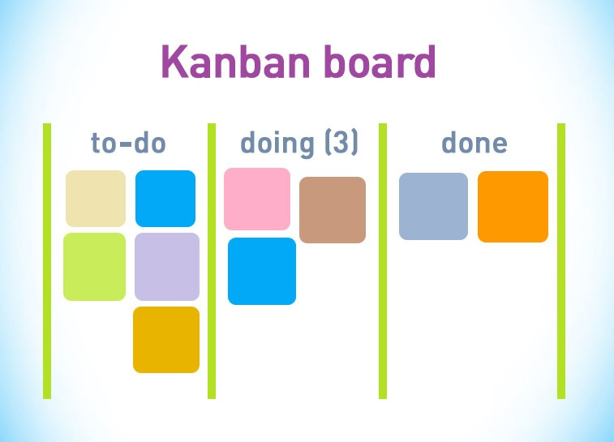

# Metodología Kanban

La metodología Kanban está basada en una gestión del trabajo de manera fluída, esta busca la eficiencia en los sistemas  
de producción organizacional disminuyendo retrasos y atendiendo la carga de trabajo de cada uno de los integrantes del equipo.

#### Tablero Kanban

El tablero Kanban delimita las fases del proceso en donde cada una de las tareas está representada con una tarjeta   
que se iraá moviendo a través del las fases (para hacer, haciendo y hecho).

### Beneficios clave de Kanban

1. Se estimula el rendimiento. Estimaciones y análisis permiten medir el rendimiento, detectar problemas, ajustar   
el trabajo para incrementar la eficiencia, al ser flexible se permite perfeccionar procesos y generar mejores resultados.
2. Colaboración y organización. Con el uso de tarjetas, columnas y carriles existe un enfoque visual; se fomenta   
el trabajo en equipo con colaboración en tiempo real, estos tableros permiten el acceso al flujo de trabajo desde   
cualquier sitio, compartir tareas y establecer comunicación con los colaboradores.
3. Distribución del trabajo. Se observan los trabajos en curso sin necesidad de dedicar mucho tiempo a la distribución   
y presentación de estos, se reduce el tiempo de espera y asignación de tareas; estas son seleccionadas por cada integrante   
por lo que no esperarás a que la tarea vaya hacia ti.

### Principios básicos de Kanban

1. Ayuda en la toma de decisiones sobre el trabajo.
2. Mejora continua (yendo directo al grano, si algo no funciona se cambia o se mejora).
3. Roles establecidos bien definidos.
4. Se gestionan todos los niveles del proceso.
