# Visual Studio Code

VSC es un editor de código ligero de grandes capacidades y con la ventaja de estar disponible para Linux, Windows y OsX;, cuenta con soporte nativo para JS, TypeScript y Node.js, agregado a esto tiene una infinidad de complemtnos para trabajar practicamente con cualquier lenguaje de programación.  

## Principales configuraciones de VSC

## Opciones generales de entorno

### Paquetes de idiomas

Permiten a traducción de la interfaz a una buena variedad de idiomas.

### Temas de color

Para personalizar el color y color de fondo de todos los elementos en la interfaz.

### Areas de trabajo (Workspace)

*  Carpetas
Se compone de una carpeta raíz de toda el área de trabajo así como su contenido (archivos y subcarpetas).  
Para cambiar de área de trabajo:    
Archivo > Abrir carpeta... o   
Archivo > Abrir reciente.

* Areas de trabajo
Integradas por varias carpetas distintas y los elementos que estas contengan.  
Para añadir carpetas al área de trabajo:  
Archivo > Agregar carpeta al espacio de trabajo  
Para guardar el área de trabajo:  
Archivo > Guardar espacio de trabajo como...  
Para abrir un área de trabajo:  
Archivo > Abrir el Espacio de trabajo...

### Preferencias de configuración

Se especifica a detalle el comportamiento de las funciones y herramientas.

* Configuración de usuarios. Aplican a cualquier documento editado sin importar la ubicación.
* Configuración de área de trabajo. Se aplica a los ficheros contenidos en un área de trabajo o determinada carpeta o en sus subcarpetas.

Cambiar preferencias de configuración:  
Archivo > Preferenicas > Configuración

### Plugins

Se dispone de una gran cantidad de extensiones a utilizar dependiendo de las necesidades en el desarrollo, de esta forma se amplian las características del editor.

Instalar extensiones:
1. Clic en el ícono de "Extensiones" de la barra de actividades.

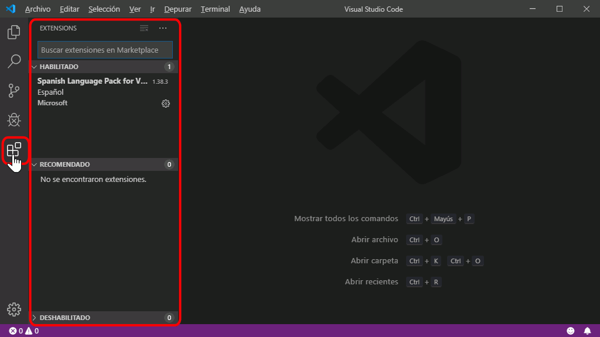

2. En el cuadro de búsqueda escribir un término y aparecerán las extensiones relacionadas.

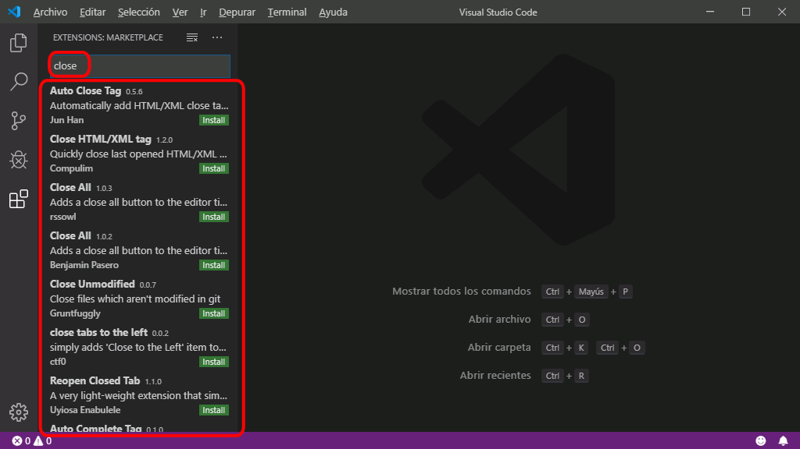

3. Clic en el nombre de la extensión para abrir una pestaña con información detallada.

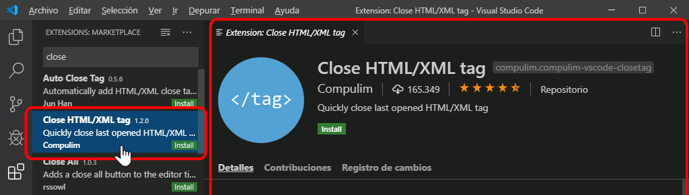

4. Para instalar la extensión hacer clic sobre el botón correspondiente.

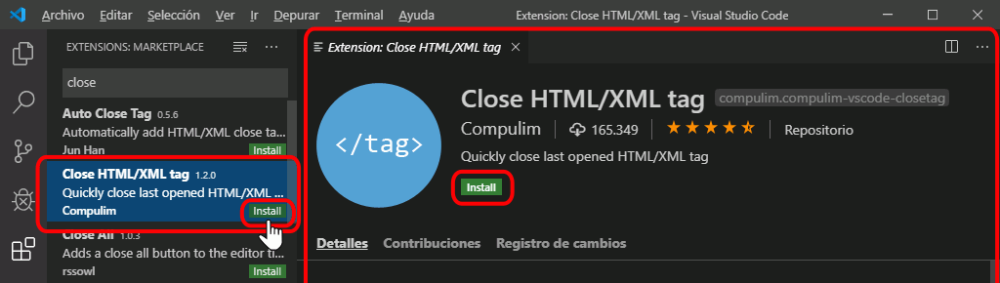

5. Después de unos segundos se instalará la extensión, en algunos plugins se requiere reiniciar VSC indicará esto.

6. Si se desea salir del buscador de extensiones y volver a la lista de estas hacer clic en el ícono de la parte superior.

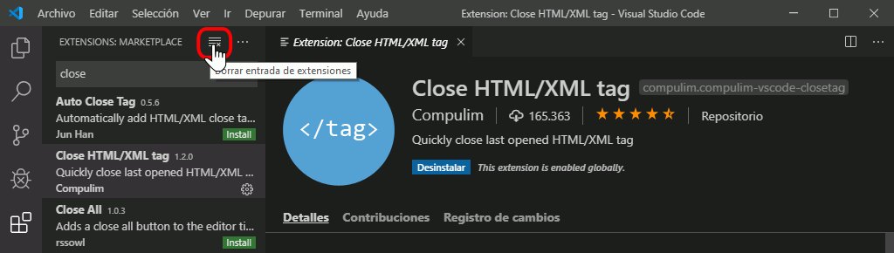

7. VSC mostrará la extensión que recién se instaló en la lista de extensiones.

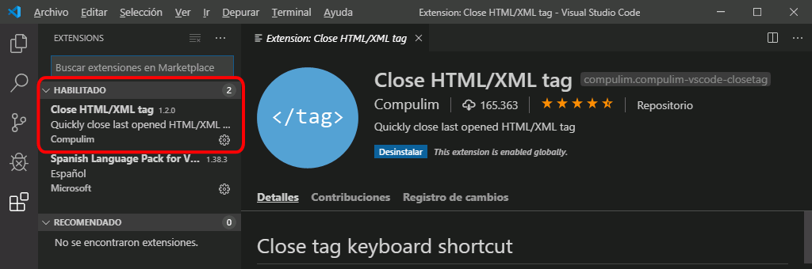

### Tareas de VSC

Permiten automatizar el uso de programas ajenos al editor, se definen de forma escrita en un archivo (task.json) y son llamadas por medio de la interfaz o por atajos de teclado; el resultado de tareas se muestra en la ventana de Terminal.

Las tareas se asocian a áreas de trabajo, por lo que se requiere abrir una carpeta o área de trabajo para crear tareas.
 
### Crear una tarea

1. Terminal > Configurar Tareas
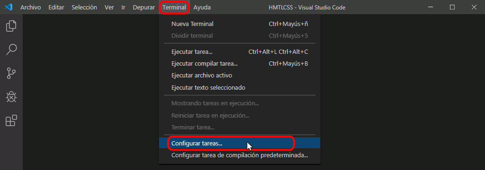

2. Se muestra un cuadro con los distintos tipos de tareas:
* Si aparece la opción "echo", ya existe el archivo y solamente contiene la tarea de ejemplo hacer clic en esa opción:

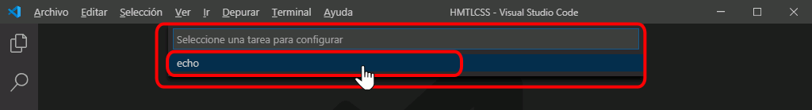

* Si aparece "Crear archivo task.json ..." es que aun no existe task.json, hacer clic en esta opción:

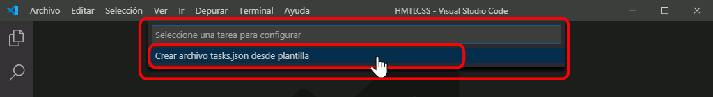

3. Se muestra enseguida una lista de plantillas de tareas, hacer clic en "Others":

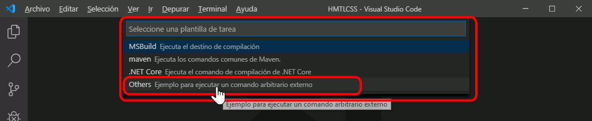

4. Aparecerá el archivo tasks.json en una pestaña con una tarea de ejemplo, tasks.json se crea en la carpeta .vscode en la raíz del área de trabajo:

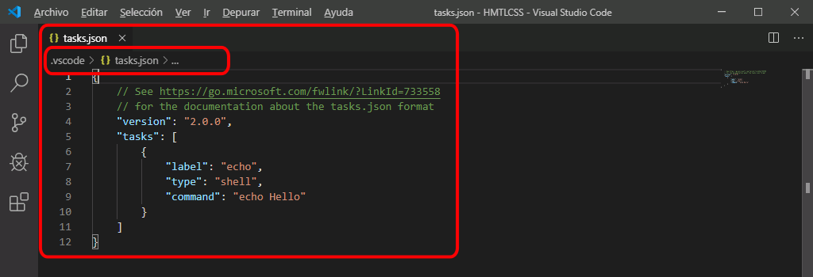

Este archivo tiene un ejemplo de tarea con el mensaje "Hello" en terminal:

    {
        // See https://go.microsoft.com/fwlink/?LinkId=733558
        // for the documentation about the tasks.json format
        "version": "2.0.0",
        "tasks": [
            {
                "label": "echo",
                "type": "shell",
                "command": "echo Hello"
            }
        ]
    }

5. Modificar el archivo tasks.json con la o las tareas deseadas y guardar.

Ejemplo. Tarea que abriría el navegador Firefox:

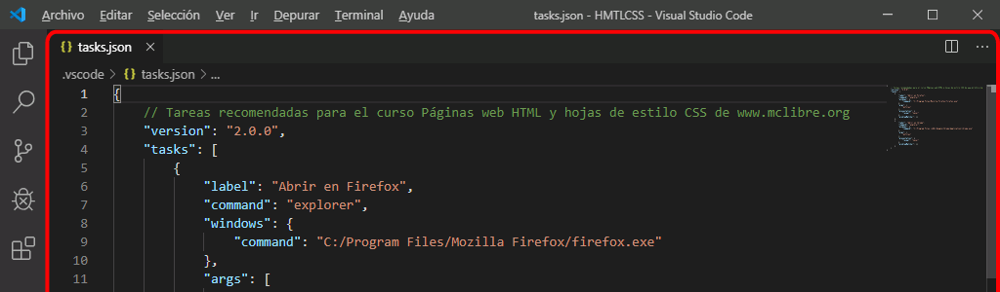

6. tasks.json creado en la carpeta .vscode creada en la raíz del área de trabajo, lo que permite que la tarea pueda se utilizada en todos los archivos del área de trabajo; si se abre otra área de trabajo y se quiere hacer uso de la misma tarea se tendrá que crear de nuevo o copiar el archivo tasks.json.

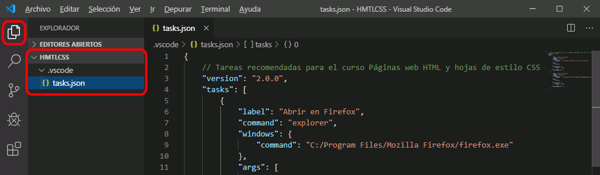

### Usar una tarea

1. Abrir en una pesataña la página a la que se quiere aplicar la tarea.

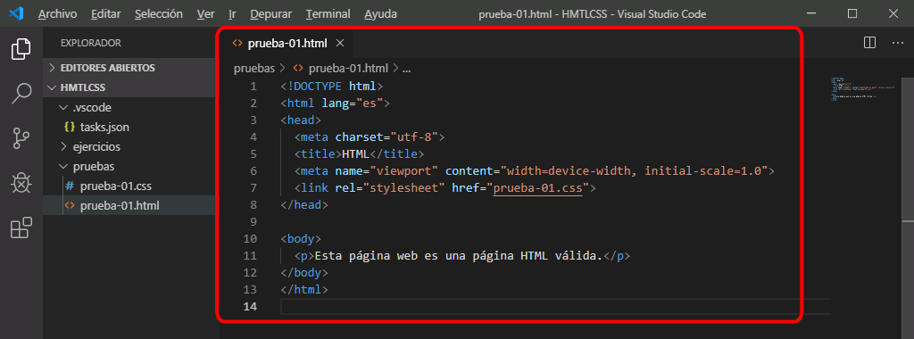

2. En el menú, Terminal > Ejecutar tarea ...

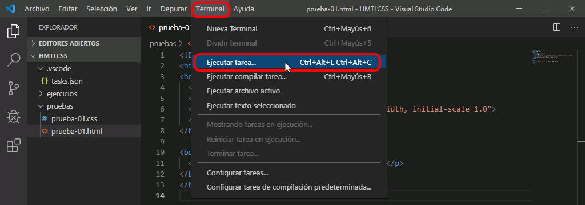

3. Se muestra un cuadro con las tareas disponibles, clic en la que se quiera aplicar:

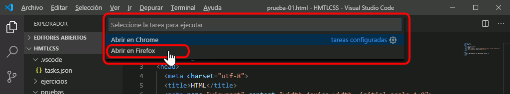

4. El resultado depende de la tarea que se elija.

En el ejemplo de las capturas, se abre el navegador y página elegidos:

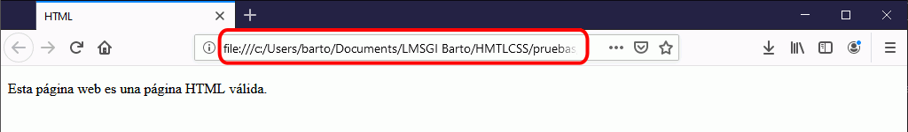

### Atajos de teclado

VSC proporciona un buen número de atajos de teclado para el acceso a muchas funciones, así como la capacidad para crear nuevos atajos de teclado y optimizar el trabajo.

* Documentación de VSC: [Documentacion VSC - Atajos de teclado](https://code.visualstudio.com/docs/getstarted/keybindings)

* Resumen de Atajos: [Windows](https://code.visualstudio.com/shortcuts/keyboard-shortcuts-windows.pdf) - [Mac](https://code.visualstudio.com/shortcuts/keyboard-shortcuts-macos.pdf) - [Linux](https://code.visualstudio.com/shortcuts/keyboard-shortcuts-linux.pdf)

#### Crear o modificar atajos de teclado

1. Archivo > Preferencias > Métodos abreviados de teclado, o en el ícono "Administrar" y elegir la opción de menú "Métodos abreviados de teclado":

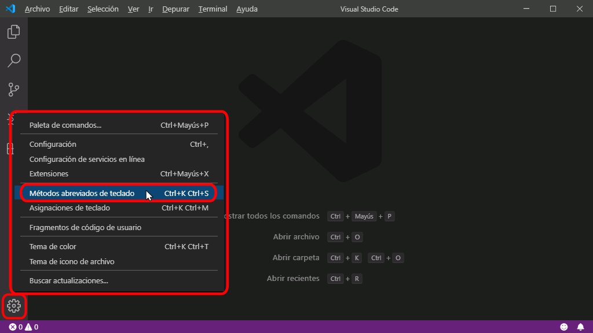

2. Se mostrará el archivo de atajos de teclado predeterminados de VSC en una pestaña, hacer clic en el ícono de documento en la parte superior derecha:
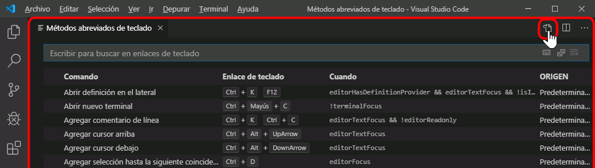

3. Se mostrará el fichero global de atajos de teclado "keybindings.json", en el caso de configuración global (Usuario) en Windows se encuentra en C:\Users\NombreUsuario\AppData\Roaming\Code\User\

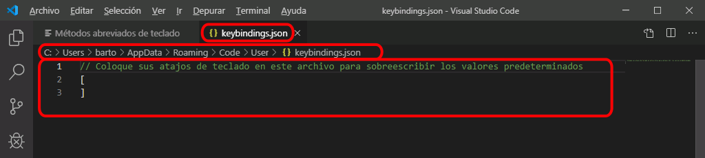

4. Modificar el contenido de keybindings.json con los atajos de teclado y guardar el archivo:
En la captura se muetran atajos para abrir ficheros en Firefox y Chrome, estos serían:
* Ctrl+Alt+f, para Abrir en Firefox
* Ctrl+Alt+c, para Abrir en Chrome

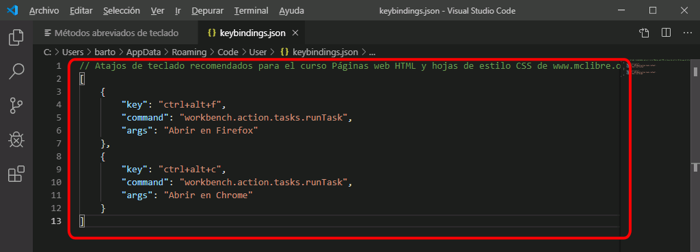

### Temas adicionales relacionados a la personalización

## Rutas en archivos JSON

Para los archivos de configuración JSON (settings.json, keybindings.json, tasks.json, etc.), las rutas del sistema operativo se deberán escribir con barras simples (/) o contrabarras dobles (\\\\), no con contrabarras simples (\\), ya que la contrabarra es un caracter de escape; ejemplos:

Correcto:  
    // PHP: Validate: Executable path  
    // Ubicación del intérprete de PHP.  
    "php.validate.executablePath": "C:/xampp/php/php.exe",

Correcto:  
    // PHP: Validate: Executable path  
    // Ubicación del intérprete de PHP.  
    "php.validate.executablePath": "C:\\xampp\\php\\php.exe",

Incorrecto:
    // PHP: Validate: Executable path  
    // Ubicación del intérprete de PHP.  
    "php.validate.executablePath": "C:\xampp\php\php.exe",

  
  
Fuentes de Consulta:

Sintes (2019).Temas de informática  
Recuperado el 5 de diciembre de 2019 desde:     
[www.mclibre.org/consultar/informatica/lecciones/vsc-personalizacion.html#atajos](http://www.mclibre.org/consultar/informatica/lecciones/vsc-personalizacion.html#atajos)

Purdila (2017). Visual Studio Code: Mi nuevo editor de código favorito.  
Recuperado el 5 de diciembre de 2019 desde:  
[https://webdesign.tutsplus.com/es/tutorials/visual-studio-code-my-new-favorite-code-editor--cms-28012](https://webdesign.tutsplus.com/es/tutorials/visual-studio-code-my-new-favorite-code-editor--cms-28012)